## Why This Post Exists

Most teams building with LLMs today have shipped a RAG pipeline. Retrieve documents, stuff them into context, generate an answer. It works — until it doesn't.

The moment your system needs to **reason** across multiple information sources, **decide** which tool to call, **recover** from a bad tool result, or **learn** from its own mistakes — RAG breaks down. Not because retrieval is wrong, but because retrieval alone is not enough.

This post is a technical walkthrough of two production AI agent systems I built — **Piper** and **Nova** — to serve as a customer support agent across 100 diverse household appliance products. Both systems go far beyond retrieve-and-generate. They reason, plan, use tools, evaluate their own outputs, and persist learnings across sessions.

Piper is a **monolith pipeline** — a 15-stage sequential processor built on gRPC microservices. Nova is its **evolution** — a LangGraph state machine that decomposes the same cognitive architecture into a declarative, composable graph.

This post covers what I built, why I built it that way, what broke, what I'd do differently, and how to operationalize and evaluate these systems in production.

> _If you're an engineer who has shipped RAG and is asking "what's next?" — this is the post I wish I had when I started._

**Video walkthroughs:** [Piper on YouTube](https://youtu.be/eAgGoFeqIPU) | [Nova on YouTube](https://youtu.be/6ggdhxMrtkg)

---

## The Gap Between RAG and Agents

RAG answers a narrow question: _given a user query, find relevant documents and generate a response._ That is a retrieval problem with a generation layer on top.

An agent answers a broader question: _given a user goal, figure out what to do, do it, verify the result, and improve over time._

The architectural gap between these two is not incremental. It is structural.



Consider three queries against a household appliance catalog, each one step beyond what RAG can handle:

> **Query 1:** _"Tell me about the RoboCleaner 3120."_
> RAG handles this. Embed the query, retrieve the product document, generate a summary. Done.

> **Query 2:** _"Compare the warranty of RoboCleaner 3120 and SuperVac 5500, and tell me which is the better deal considering price."_
> RAG breaks. This requires two separate tool calls (warranty lookup for each product), a price lookup, and multi-dimensional reasoning across all three results. A single retrieval-and-generate pass cannot do this.

> **Query 3:** _"I asked about the RoboCleaner earlier. What was the warranty again? And is there anything cheaper with a longer warranty?"_
> RAG breaks harder. This requires session memory (what was discussed earlier), pronoun resolution ("the RoboCleaner" → RoboCleaner 3120), a warranty lookup, a filtered price search, and comparative reasoning. Five capabilities that RAG does not have.

| Capability | RAG | Agent |
|-----------|-----|-------|
| Retrieve information | Yes | Yes |
| Decide which source to query | No | Yes (tool selection) |
| Recover from bad retrieval | No | Yes (ReACT self-correction) |
| Multi-step reasoning | No | Yes (planning + iteration) |
| Quality self-assessment | No | Yes (reflection) |
| Cross-session learning | No | Yes (reflexion) |
| Input/output safety | Optional (but rarely built) | Yes (guardrails — required due to tool use and multi-step execution) |
| Structured evaluation | No | Yes (per-request metrics) |

---

## The Agent Harness: Where Reliability Lives

OpenAI's data agent team [articulated](https://blog.bytebytego.com/p/how-openai-built-its-data-agent) something I learned the hard way building Piper and Nova: **the agent itself is simple — the reliability comes from the engineering around it.**

They call this the **agent harness**. An agent is an LLM plus a harness. The LLM provides reasoning. The harness provides everything else: context assembly, tool management, quality gates, memory, and evaluation. The harness is what turns a raw language model into a system you can trust in production.

This is the most important architectural insight in agent engineering. The LLM is the engine, but the harness is the car — steering, brakes, and seatbelts. Without the harness, you have an engine on a bench. With it, you have a vehicle.

Both Piper and Nova are, fundamentally, agent harnesses. The LLM (Claude) is the same in both. What changed between them was **how the harness is structured** — from a monolith pipeline to a composable graph.

The harness has five layers:

| Layer | Purpose | Piper | Nova |
|-------|---------|-------|------|
| **Context Assembly** | Build structured memory for the LLM | 3-section format (Flow/Active/Latest) | Same, via `context_loader` node |
| **Tool Curation** | Provide the right tools — and only those | 4 domain tools, JSON schemas, validation | Same tools, schema-validated per-node |
| **Reasoning Engine** | Let the LLM think, act, observe, iterate | ReACT loop, max 8 iterations | Same, as dedicated graph node |
| **Quality Gates** | Verify output before delivery | Reflection (evaluate/refine) + guardrails | Same, as separate composable nodes |
| **Learning & Evaluation** | Improve over time, measure everything | Reflexion + TimescaleDB eval records | Same, with per-node event streaming |

Every section that follows maps to one or more layers of this harness.

---

## Piper: The Monolith Pipeline

Piper was the first harness I built. It is a **15-stage sequential pipeline** where every customer query passes through the same ordered sequence of processing stages. Think of it as an assembly line — each station performs one cognitive operation, and the query moves to the next.

### Architecture

Piper runs as **7 gRPC microservices** orchestrated by a central Agent Service:



The services are separated by **concern**, not by pipeline stage. The LLM Service wraps the Anthropic Claude API. The Memory Service manages three storage tiers (Redis for session cache, PostgreSQL for relational data, TimescaleDB for immutable audit logs). The Tool Service validates and executes domain tools. The Knowledge Service handles Voyage AI embeddings and pgvector semantic search.

But the **pipeline itself** — all 15 stages — runs inside a single `ProcessQuery()` method on the Agent Service.

### The 15-Stage Pipeline



Every query traverses this pipeline top to bottom. Each stage is **feature-flagged** — you can disable query rewriting, reflection, reflexion, planning, or multi-agent orchestration independently via environment variables. This was critical for debugging and for A/B testing individual stages.

### Why a Monolith Pipeline?

The monolith was a deliberate choice for the first iteration. When you are figuring out what cognitive stages an agent needs, you want **simplicity over modularity**. A linear pipeline gives you:

- **Predictable state flow** — stage N always sees the output of stage N-1
- **Easy debugging** — print the state between any two stages
- **Fast iteration** — change one stage, restart one service
- **Feature flags** — toggle any stage without rewiring dependencies

The tradeoff is that you cannot scale stages independently, the slowest stage blocks the entire pipeline, and the Agent Service becomes a 2,000+ line monolith.

---

## What Piper Taught Me (and What Went Wrong)

After building and running Piper, three categories of problems became clear — and none of them were about the LLM.

### 1. Coupling Kills Iteration Speed

All 15 stages live in a single `ProcessQuery()` method. When I needed to add evaluation storage (Stage 12), I had to modify the same 2,000-line function that handles guardrails, intent classification, and the ReACT loop. The diff touched 4 different parts of the function — the method signature, the initialization block, the post-response block, and the streaming block. One stage addition required understanding the entire function.

Worse, reordering stages was terrifying. When I moved output guardrails from after reflexion to after reflection (to catch PII introduced by the refiner), I broke the evaluation record — it was reading `output_sanitized` from a variable that had not been set yet. The dependency was invisible because it existed only as a local variable, not as a contract.

### 2. State Is Implicit

The pipeline threads state through local variables. There is no explicit contract for what data each stage produces or consumes. Stage 6 (ReACT) might set `final_answer` that Stage 9 (Reflection) reads, but this dependency is invisible in the code structure. I discovered three cases where stages were reading stale state from a previous query because I forgot to reset a variable in the initialization block. In a graph with an explicit state contract, these bugs are structurally impossible.

### 3. Fewer Tools Beat More Tools

I initially designed 8 tools: `product_search`, `price_lookup`, `warranty_check`, `product_compare`, `product_details`, `category_browse`, `price_range_filter`, and `brand_list`. The agent constantly confused `product_search` with `product_details` and `price_lookup` with `price_range_filter`. It would waste 2-3 ReACT iterations trying one tool, getting a suboptimal result, then trying the overlapping tool.

I cut to **4 tools with zero overlap**. Each tool has a distinct name, a distinct purpose, and a distinct parameter schema. Performance improved immediately — average ReACT iterations dropped from 4.2 to 2.1. This matches exactly what OpenAI discovered: they started with 40 tools and cut to 13. **Tool curation is a harness concern, not an LLM concern.** The LLM does not get smarter with more tools. It gets confused.

### 4. Guide Goals, Not Paths

My early ReACT prompts were prescriptive: _"First search for the product, then look up the price, then check the warranty."_ The agent followed these instructions literally even when they were wrong for the query. A customer asking "What's the cheapest option?" would still trigger a warranty check because the prompt said to.

I switched to goal-oriented prompting: _"Use tools to get factual information. Do not make up product details."_ The agent started choosing the right tools for each query. Fewer instructions led to better reasoning — because the LLM's job is to reason, and the harness's job is to provide the tools and validate the results.

---

## Nova: The LangGraph Evolution

Nova takes every lesson from Piper and re-expresses the same cognitive architecture as a **LangGraph StateGraph** — a declarative directed graph where nodes are processing functions and edges are routing decisions.

### The State Contract

The single most important change from Piper to Nova is the **explicit state definition**. Instead of implicit local variables, every piece of data flowing through the system is declared in a TypedDict:

```python
class AgentState(TypedDict):
    # Identity & input
    session_id: str
    customer_id: str
    query: str                    # Rewritten, self-contained query

    # Memory
    memory_context: str           # Structured 3-section context
    previous_intent: str          # For follow-up detection

    # Classification
    intent: str                   # 1 of 9 intent types
    confidence: float             # 0.0–1.0
    domain_relevance: float       # 0.0–1.0

    # Reasoning
    react_steps: list             # Accumulated Thought/Action/Observation
    tools_used: list              # Tools called in this request
    final_answer: str             # Raw answer from ReACT

    # Quality
    reflection_score: float       # Pre-refinement score
    framed_response: dict         # {text, confidence, sources}

    # Events (append-only via reducer)
    events_buffer: Annotated[list, add]
```

The full state has ~30 fields including planning, multi-agent, output guardrails, and recommendations — the complete definition is in the [Nova source code](https://github.com/keshavksingh/nova-langraph-ai-agent). What matters is the principle: **every node reads from and writes to this contract**. There are no implicit dependencies. The contract is the documentation.

### The Graph Topology



Three things to notice:

**1. Short-circuit paths.** Session queries, out-of-scope queries, and clarification requests exit the graph immediately without touching the expensive ReACT loop. In Piper, these still passed through every subsequent stage (with no-ops). In Nova, they take the fast path to END. This alone cut latency for simple queries by 40%.

**2. Converging paths.** Both `run_react_loop` and `run_multi_agent` converge into `frame_response`. The Quality phase (reflection → guardrails → reflexion → evaluation → delivery) is shared. No code duplication.

**3. Conditional routing is declarative.** The graph definition specifies edges and conditions. You can read the routing logic without reading any node implementation. Adding a new node means wiring two edges, not modifying a 2,000-line function.

### Node Implementation

Each node is a pure function: `(AgentState) -> Partial[AgentState]`. It reads what it needs from the state, does its work, and returns only the fields it modifies. This makes every node independently testable:

```python
def check_input_guardrails(state: AgentState) -> dict:
    query = state["query"]
    issues = []

    if len(query) > 2000:
        issues.append("Query exceeds maximum length")

    for pattern in INJECTION_PATTERNS:
        if pattern.search(query):
            issues.append("Potential prompt injection detected")
            break

    is_safe = not any("injection" in i or "length" in i for i in issues)

    return {
        "input_guardrail_safe": is_safe,
        "input_guardrail_issues": issues,
        "route": "blocked" if not is_safe else "continue",
        "events_buffer": [{"type": "guardrail_check", "payload": {...}}]
    }
```

In Piper, this logic was embedded inside the monolith. In Nova, you can test this node in isolation with a mocked state dictionary and verify exactly which fields it reads and writes.

---

## The Cognitive Architecture: Three Layers of Intelligence

Both Piper and Nova implement the same three-layer cognitive architecture. This is the core of the agent harness — the framework applies regardless of whether you use a monolith pipeline or a graph.

### Layer 1: ReACT — Reasoning + Acting

The ReACT loop is the agent's core reasoning engine. It follows a simple pattern: **Think before you act. Observe the result. Think again.**



The LLM produces output in one of two patterns:

**Pattern A — Tool Call:**
```
Thought: The user is asking about affordable washing machines.
I need to search for products in that category and price range.
Action: product_search({"query": "affordable washing machine", "top_k": 5})
```

**Pattern B — Final Answer:**
```
Thought: I now have the product details, pricing, and warranty information.
I can provide a complete answer.
Answer: The UltraWasher 8262 is priced at $121.24 with a 6-month warranty...
```

**The loop is dynamic, not fixed.** It runs up to 8 iterations but exits the moment the LLM produces an Answer. Simple queries resolve in 1-2 iterations. Complex comparisons may take 3-4. The agent decides when it has enough information.

**Self-correction is built in.** When the LLM calls a tool with wrong parameters, the validation error becomes the next observation. The LLM reads the error, corrects the parameters, and retries:

```
Iteration 3:
  Thought: I need to check the warranty for this product.
  Action: warranty_check({"name": "RoboCleaner 3120"})
  Observation: Parameter validation error: Missing required field 'product_name'

Iteration 4:
  Thought: I used the wrong parameter name. The field is 'product_name', not 'name'.
  Action: warranty_check({"product_name": "RoboCleaner 3120"})
  Observation: {"product_name": "RoboCleaner 3120", "warranty_months": 36, ...}
```

This is not error handling in the traditional sense. It is the agent **learning from its own mistakes within a single request**. The harness enables this by feeding tool errors back as observations instead of crashing.

### Layer 2: Reflection — Fix Now

After the ReACT loop produces a response, the Reflection stage evaluates it against five quality criteria:

| Criterion | Question | Score |
|-----------|----------|-------|
| Completeness | Does it fully answer the query? | 0.0–1.0 |
| Accuracy | Are product details factually correct per tool observations? | 0.0–1.0 |
| Relevance | Is it focused on what was asked? | 0.0–1.0 |
| Clarity | Is it well-organized and easy to understand? | 0.0–1.0 |
| Actionability | Does it provide useful next steps? | 0.0–1.0 |

If the overall score falls below **0.75**, the system triggers a refinement cycle. The LLM receives the original response, the critique (specific issues and suggestions), and the raw tool observations, then generates an improved version — **without re-running any tools**. The data is already fetched; only the presentation needs fixing.

This evaluate-refine loop runs a maximum of **2 iterations**. Every failure mode defaults to pass-through — reflection can only improve a response, never block it.

### Layer 3: Reflexion — Learn Forever

Reflexion is the persistent learning layer. While Reflection fixes the current response, Reflexion fixes **all future responses** for similar queries.



**Write path:** After each response, if the reflection score was below 0.7, the system generates a structured insight — the query pattern, the failure reason, a suggested improvement, and key topics for matching. This insight is stored in TimescaleDB as an immutable episodic memory, tagged with the customer ID and intent.

**Read path:** Before the ReACT loop starts on a new query, the system fetches up to 3 relevant past insights — matched by intent or topic overlap — and injects them into the system prompt.

**Example:** The agent once failed a warranty comparison because it queried only one product before generating the answer. The reflection score was 0.52. Reflexion generated: _"When comparing warranties, check all products before generating the answer."_ Three sessions later, a different customer asked a similar question. That insight was injected into the ReACT prompt. The agent queried both products, and the reflection score was 0.91.

This is not fine-tuning. It is not RAG over past conversations. It is **structured self-reflection stored as persistent memory and retrieved at inference time**. The agent genuinely learns from experience. And this is your competitive advantage — reflexion means your deployment accumulates wisdom from your users' queries and your agent's mistakes. No other team gets that wisdom. It compounds over time.

---

## A Query Through the Harness: End-to-End Walkthrough

To make the architecture concrete, here is a real query traced through every stage of the Nova harness:

**Customer query:** _"How does the warranty on the RoboCleaner 3120 compare to the SuperVac 5500?"_

---

**Stage 1 — Context Assembly** (`load_context`)

The system loads the last 10 conversation turns from memory. This customer previously asked about vacuum cleaners. The structured context includes:
```
ACTIVE CONTEXT:
Products discussed: RoboCleaner 3120
Previous intents: product_inquiry
Recent tools: product_search
```

**Stage 2 — Input Guardrails** (`check_input_guardrails`)

Regex scan: no injection patterns, no PII, length under 2,000 chars. Result: `safe`. Route: `continue`.

**Stage 3 — Query Rewrite** (`rewrite_query`)

The query is already self-contained (both product names explicit). Rewriter returns the original unchanged. LLM call skipped — no history-dependent pronouns to resolve.

**Stage 4 — Intent Classification** (`classify_intent`)

LLM call (temp 0.1) returns:
```json
{
  "intent": "comparison",
  "confidence": 0.94,
  "domain_relevance": 0.95,
  "entities": ["RoboCleaner 3120", "SuperVac 5500"],
  "needs_clarification": false
}
```
Route: `normal` (confidence above 0.8, domain relevance above 0.5, no clarification needed).

**Stage 5 — Planning** (`generate_plan`)

LLM call (temp 0.2) decomposes the query:
```json
{
  "needs_multi_agent": false,
  "plan_steps": [
    {"goal": "Get warranty details for RoboCleaner 3120", "suggested_tool": "warranty_check"},
    {"goal": "Get warranty details for SuperVac 5500", "suggested_tool": "warranty_check"},
    {"goal": "Compare and summarize findings", "suggested_tool": null}
  ]
}
```
Route: `standard` (single ReACT loop, not multi-agent).

**Stage 6 — ReACT Loop** (`run_react_loop`)

*Reflexion injection:* Before starting, the system fetches past insights (recall the reflexion write/read paths from the cognitive architecture above). One match found from a previous session: _"When comparing warranties, check all products before generating the answer."_ Injected into the system prompt.

**Iteration 1:**
```
Thought: I need warranty details for both products. Let me start with RoboCleaner 3120.
Action: warranty_check({"product_name": "RoboCleaner 3120"})
Observation: {"product_name": "RoboCleaner 3120", "warranty_months": 36,
              "manufacturing_date": "2024-03-15", "price": 499.99}
```

**Iteration 2:**
```
Thought: Now I need warranty details for SuperVac 5500.
Action: warranty_check({"product_name": "SuperVac 5500"})
Observation: {"product_name": "SuperVac 5500", "warranty_months": 12,
              "manufacturing_date": "2024-08-22", "price": 329.99}
```

**Iteration 3:**
```
Thought: I have warranty data for both products. RoboCleaner 3120 has 36 months
warranty at $499.99, SuperVac 5500 has 12 months at $329.99. I can now compare.
Answer: The RoboCleaner 3120 offers significantly better warranty coverage at
36 months compared to the SuperVac 5500's 12 months. The RoboCleaner is priced
higher at $499.99 vs $329.99, but the 3x longer warranty may justify the
$170 price difference depending on your priorities...
```

3 iterations. 2 tool calls. Final answer generated.

**Stage 7 — Response Framing** (`frame_response`)

LLM call (temp 0.2) polishes the raw ReACT answer into user-facing language. Returns:
```json
{
  "text": "The RoboCleaner 3120 comes with a 36-month warranty, three times longer than...",
  "confidence": 0.91,
  "sources": ["RoboCleaner 3120", "SuperVac 5500"]
}
```

**Stage 8 — Reflection** (`run_reflection`)

LLM evaluates the response:
```json
{
  "overall_score": 0.88,
  "completeness": 0.90,
  "accuracy": 0.95,
  "relevance": 0.90,
  "clarity": 0.85,
  "actionability": 0.80,
  "needs_refinement": false
}
```
Score 0.88 ≥ 0.75. No refinement needed. Pass through.

**Stage 9 — Output Guardrails** (`check_output_guardrails`)

Regex scan on the framed response. No PII detected. Output clean.

**Stage 10 — Reflexion** (`store_reflexion`)

Reflection score 0.88 ≥ 0.7. No insight generated. Reflexion skipped.

**Stage 11 — Evaluation Storage** (`store_evaluation`)

Metrics written to TimescaleDB:
```json
{
  "intent": "comparison",
  "confidence": 0.94,
  "reflection_score": 0.88,
  "tools_used": ["warranty_check", "warranty_check"],
  "reasoning_steps": 3,
  "latency_ms": 8420,
  "response_length": 312
}
```

**Stage 12 — Delivery** (`deliver_response`)

Response streamed word-by-word to the client via WebSocket. The Recommendation Service is called with the last query, truncated response, and detected intent. It extracts the current focus (RoboCleaner 3120, from the response), maps the `comparison` intent to its template strategy, and runs co-occurrence analysis. The customer sees three follow-up suggestions:

1. _"Tell me about RoboCleaner 3120 features"_
2. _"How much does RoboCleaner 3120 cost?"_
3. _"Users who asked about RoboCleaner 3120 also explored PowerDrill 5641"_

The first two are intent-anchored (comparison → features and price as natural next questions). The third comes from cross-user co-occurrence data — other customers who discussed the RoboCleaner also explored the PowerDrill. No LLM call required — the recommendations are generated from structured data in under 50ms.

**Total latency: 8.4 seconds. Total LLM calls: 7** (classify + plan + 3 ReACT iterations + framing + reflection). Total tool calls: 2.

---

## Monolith vs Graph: The Tradeoffs

Having built both, here is an honest comparison:

| Dimension | Piper (Monolith) | Nova (LangGraph) |
|-----------|-------------------|-------------------|
| **Code structure** | 2,000+ lines in one file | ~100-250 lines per node across 15+ files |
| **State management** | Implicit local variables | Explicit TypedDict contract |
| **Testing** | Must mock entire pipeline | Unit test each node independently |
| **Debugging** | Print statements between stages | Full event stream + state snapshots |
| **Feature flags** | Scattered `if` statements | Config-driven, per-node enable/disable |
| **Adding a stage** | Modify the monolith function | Add a node, wire two edges |
| **Removing a stage** | Comment out code, hope nothing breaks | Remove node and edges from graph definition |
| **Error handling** | Hand-coded conditionals | Graceful fallbacks per node, no cascading |
| **Routing logic** | `if/elif/else` chains | Declarative conditional edges |
| **Observability** | Log statements | Structured event buffer drained per step |
| **Learning curve** | Low (it's just a function) | Medium (LangGraph concepts) |
| **Iteration speed** | Fast for first 3 stages, slow after 10 | Consistent regardless of graph size |

### When to Use Which

**Start with a monolith pipeline when:**
- You are still discovering what stages your agent needs
- The team is new to agent architectures
- You have fewer than 5-6 processing stages
- You need to ship fast and learn

**Move to a graph architecture when:**
- You have 8+ stages with conditional routing
- Multiple team members need to work on different stages
- You need to test stages in isolation
- Error handling is becoming a mess of nested conditionals
- You want to add/remove/reorder stages without regression risk

The monolith is not a mistake. It is a prototype. The graph is not a refactor. It is a re-architecture informed by what the prototype taught you.

---

## Multi-Agent Orchestration: Specialists Over Generalists

Both systems support **multi-agent orchestration** — dispatching specialized sub-agents for complex queries that span multiple domains.

Three specialist agents are defined:

| Specialist | Domain Focus | Preferred Tools |
|-----------|-------------|-----------------|
| Product Specialist | Features, specifications, descriptions | `product_search`, `price_lookup` |
| Warranty Specialist | Warranty policies, coverage, claims | `warranty_check` |
| Comparison Specialist | Cross-product analysis, tradeoffs | `product_search`, `price_lookup`, `product_compare` |

When a customer asks _"Compare the warranty and price of RoboCleaner 3120 vs SuperVac 5500"_, the planner identifies this as a multi-agent query. It dispatches the Warranty Specialist and the Comparison Specialist sequentially. Each specialist runs its own ReACT loop (capped at 4 iterations) with a focused system prompt and restricted tool set. After all specialists complete, a synthesis LLM call combines their findings into a unified response.

**Why sequential, not parallel?** Predictability. In a customer-facing system, I want deterministic execution order and clear error attribution. If the Warranty Specialist fails, I know exactly which step failed and can fall back gracefully. Parallel execution would be faster but harder to debug and recover from.

The pattern scales: as agent complexity grows, decomposing into focused specialists with narrow tool sets consistently outperforms a single generalist agent with access to everything. A generalist with 12 tools wastes iterations figuring out which tool applies. A specialist with 2 tools reasons faster and more accurately — because the harness has already made the routing decision before the LLM starts thinking.

---

## The Recommendation Engine: Closing the Conversation Loop

Most agent tutorials end at response delivery. The agent answers the question, and the session goes quiet until the customer figures out what to ask next. That is a missed opportunity. A well-designed agent should **guide the conversation forward** — surfacing relevant follow-up questions the customer might not know to ask.

Both Piper and Nova include a **Recommendation Service** — a standalone gRPC microservice (port 50057) that generates context-aware follow-up suggestions at two critical points in the customer journey.

### Cold Start: The Empty Session Problem

When a customer opens a new session, they face a blank input box and no guidance. The recommender solves this with a **4-tier cascade strategy** that fills up to 5 opening suggestions:

| Tier | Strategy | Example |
|------|----------|---------|
| **Returning User** | If the customer has episodic memory from past sessions, surface their last topic | _"Continue where you left off: RoboCleaner vs SuperVac comparison"_ |
| **Cross-User Popular** | Aggregate products across all recent conversations, rank by unique customer count | _"Tell me about PowerDrill 5641 — our most popular PowerDrill"_ |
| **Premium Showcase** | Select the highest-priced product from each distinct brand | _"Check out RoboCleaner 3120 ($499) — our premium RoboCleaner"_ |
| **Catalog-Aware Generic** | Generate brand-aware and price-aware fallback suggestions | _"Compare UltraWasher with RoboCleaner"_ |

The tiers cascade: if the customer is returning and has history, Tier 1 fills first. Remaining slots fall through to popularity, then premium showcase, then generics. Every customer sees suggestions — even on a completely cold platform with zero conversation history, the catalog-aware generics ensure the session starts with direction.

### Follow-Up: Focus-Anchored Suggestions

After every agent response, the recommender generates exactly **3 follow-up suggestions** anchored to what the customer is currently discussing. This is not random suggestion generation — it is intent-aware, product-anchored, and memory-deduplicated.

**Step 1 — Extract Current Focus.** The recommender scans the last response (stronger signal) and last query to identify the product and brand the customer is currently discussing. At equal positions, longer product names win — "PowerDrill 5641" beats "PowerDrill 5". The response is prioritized over the query because the agent may have introduced a new product the customer has not mentioned yet.

**Step 2 — Fill Intent-Aware Slots.** Based on the detected intent (`product_inquiry`, `price_check`, `warranty_question`, `comparison`), two template slots are filled. For example, after a price check on the RoboCleaner 3120:

- Slot 1: _"What's the warranty on RoboCleaner 3120?"_
- Slot 2: _"Compare RoboCleaner 3120 with alternatives in a similar price range"_

**Step 3 — Cross-User Intelligence.** The third slot uses **co-occurrence analysis** — products that appear in the same sessions as the current product. If customers who asked about RoboCleaner 3120 also frequently explored the SuperVac 5500, the third suggestion becomes: _"Users who asked about RoboCleaner 3120 also explored SuperVac 5500."_ If no co-occurring products are found, the fallback is a **price alternative** — a product from a different brand within ±20% of the current product's price.

**Step 4 — Deduplication.** Before delivery, all suggestions are deduplicated against:
- Exact duplicates (case-insensitive)
- The customer's last query (do not echo back what they just asked)
- Products already explored in episodic memory (do not resurface topics the customer has covered in past sessions)

If fewer than 3 suggestions survive deduplication, catalog-aware generics pad the list.

### In Practice: The Warranty Comparison

To make this concrete, recall the end-to-end walkthrough from earlier. After the agent delivers its warranty comparison of RoboCleaner 3120 vs SuperVac 5500, the Recommendation Service receives the response text, the detected intent (`comparison`), and the customer ID.

**Focus extraction** identifies RoboCleaner 3120 as the current product (it appears first in the response). **Intent mapping** selects the `comparison` strategy templates. **Co-occurrence analysis** finds that customers who discussed RoboCleaner 3120 also frequently explored PowerDrill 5641. The customer sees:

> 1. _"Tell me about RoboCleaner 3120 features"_
> 2. _"How much does RoboCleaner 3120 cost?"_
> 3. _"Users who asked about RoboCleaner 3120 also explored PowerDrill 5641"_

The first two suggestions guide the customer deeper into the product they are already exploring. The third surfaces a cross-sell opportunity that the customer would never have discovered on their own. All three are generated without an LLM call — pure structured data, under 50ms.

If this customer had explored the PowerDrill in a previous session (stored in episodic memory), that third suggestion would be filtered out and replaced with a **price alternative** — a product from a different brand within ±20% of RoboCleaner's price. The customer never sees a stale suggestion.

### Why This Matters

The recommendation engine is a harness concern, not an LLM concern. The LLM does not decide what to suggest next — the harness does, using structured data: conversation history, product catalog, cross-user patterns, and episodic memory. This makes the suggestions deterministic, fast (no LLM call required), and immune to hallucination.

It also creates a **flywheel effect**: more conversations generate richer co-occurrence data, which generates better suggestions, which drive more productive conversations. The recommendation engine gets better with scale — exactly the kind of compounding advantage that justifies the engineering investment in the harness.

Every data source in the recommendation pipeline has a fallback — if the database is unavailable, hardcoded brand data fills in. If co-occurrence analysis fails, price alternatives take over. If memory service is down, the customer profile returns empty and suggestions proceed without personalization. The system never fails to deliver suggestions, even in degraded mode.

---

## The Agent Harness in Practice: Operationalization

Building the agent is 40% of the work. The harness — the operational infrastructure that makes it reliable — is the other 60%. Here are the five harness layers in practice.

### Layer 1: Context Assembly

How you feed conversation history to the LLM matters enormously. Dumping raw turns into the context window wastes tokens and dilutes relevance. OpenAI's data agent team found that context assembly is the most engineering-heavy component of their harness — more complex than the agent loop itself.

Both Piper and Nova use a **three-section structured context** format:

```
=== CONVERSATION FLOW ===
1. User: Tell me about RoboCleaner 3120
   Assistant: The RoboCleaner 3120 is a robot vacuum... [product_inquiry]
2. User: What's the warranty?
   Assistant: The warranty is 36 months... [warranty_question]

=== ACTIVE CONTEXT ===
Products discussed: RoboCleaner 3120
Previous intents: product_inquiry, warranty_question
Recent tools: product_search, warranty_check

=== LATEST EXCHANGE ===
User: How much does it cost?
Assistant: (pending - this is the current query)
```

**Conversation Flow** provides chronological narrative with older turns truncated to 200 characters. **Active Context** gives the LLM a semantic summary of what has been discussed without re-reading every turn. **Latest Exchange** preserves the most recent interaction in full detail.

This approach serves the same purpose as Google ADK's **durable state machines** — instead of replaying raw conversation history and hoping the LLM infers context, you declare the context explicitly. Nova's `AgentState` TypedDict is itself a durable state schema. Every piece of state is named, typed, and persisted. Kill the server mid-conversation, restart it, and the agent resumes from the correct state with all context intact.

### Layer 2: Tool Curation

The tools your agent can call are more important than the prompt engineering. The harness lesson is about **curation, not accumulation**.

As discussed in the Piper lessons above, the tool count dropped from 8 to 4 after overlapping tools burned ReACT iterations. But curation is not just about count — it is about the interface contract each tool exposes:

- A **clear name** (`product_search`, not `search` or `find_stuff`)
- A **JSON schema** for parameters (types, required fields, descriptions)
- **Informative error messages** (not "error" but "Missing required field 'product_name'") — these become observations in the ReACT loop, enabling self-correction
- **Structured output** (JSON with consistent field names)
- **Execution logging** (every call recorded with input, output, latency, status)

The interface matters because the LLM interacts with tools through their schemas and error messages. A tool with a vague name and a generic error is invisible to the reasoning loop. A tool with a precise name and a diagnostic error is a self-correcting mechanism.

### Layer 3: Quality Gates

**Input guardrails** run before any LLM call:
- **Length check:** Queries over 2,000 characters are blocked
- **Injection detection:** 5 regex patterns catch common prompt injection attempts
- **PII warning:** 4 patterns detect emails, phone numbers, SSNs, and credit cards — logged but not blocked

**Output guardrails** run after reflection, catching PII that might have been introduced during the refinement step.

**Why regex, not LLM-based detection?** Speed. Regex runs in <1ms. An LLM-based guardrail adds 1-2 seconds per request. For a customer support agent where latency matters, regex is the right tradeoff for known patterns. LLM-based detection makes sense for nuanced policy violations that regex cannot capture — but that is a separate concern, not a blocking gate.

### Layer 4: Memory Tiers

Agents need memory at multiple time horizons:



**Redis** (30-minute TTL): Session cache for sub-millisecond reads. If Redis goes down, fall back to PostgreSQL — slower, but functional.

**PostgreSQL + pgvector**: Sessions, conversation turns, tool definitions, tool execution logs, and product embeddings (Voyage AI, 1024-dim, IVFFlat index).

**TimescaleDB**: Immutable episodic memories — reflexion insights, evaluation records, session audit trails. 7-day hypertable chunks with continuous aggregates for daily quality metrics.

Google ADK calls this **event-driven dormancy**: agents sleep when waiting for external events and wake via webhooks. The agent persists its state, the container scales to zero, and a webhook resumes the conversation with full context. Nova's three-tier memory architecture is the foundation for this pattern — session state in Redis, conversation history in PostgreSQL, and learning in TimescaleDB mean the agent can be rehydrated at any point.

### Layer 5: Graceful Degradation

Every external dependency has a fallback:

| Dependency | Failure Mode | Fallback |
|-----------|-------------|----------|
| Knowledge Service | Embeddings/search unavailable | Agent continues with other tools |
| LLM Service | API timeout or error | Retry with exponential backoff, then safe fallback message |
| Redis | Cache unavailable | Fall back to PostgreSQL for session data |
| TimescaleDB | Metrics storage down | Log warning, skip evaluation, continue serving |
| Tool Service | Tool execution fails | Error becomes observation in ReACT — LLM self-corrects |
| Recommendation Service | Suggestions unavailable | Return empty recommendations — response still delivered |

The system **never crashes due to a dependency failure**. It degrades. The customer always gets a response.

---

## Latency: The Hidden Cost of Intelligence

Agent latency is the sum of all LLM calls plus tool executions. Here is the real budget:

| Stage | LLM Calls | Latency |
|-------|-----------|---------|
| Query rewriting | 0-1 | 0-1.5s |
| Intent classification | 1 | 1-2s |
| Planning | 1 | 1-2s |
| ReACT loop (2-3 iterations) | 2-3 | 4-9s |
| Response framing | 1 | 1-2s |
| Reflection (evaluate) | 1 | 1-2s |
| Reflection (refine, if needed) | 0-1 | 0-2s |
| Reflexion (if score < 0.7) | 0-1 | 0-1.5s |
| **Total** | **7-10** | **8-21s** |

In practice, the end-to-end walkthrough above completed in **8.4 seconds** — a comparison query with 2 tool calls and 3 ReACT iterations. Simple price lookups resolve in **4-6 seconds** via short-circuit paths that skip planning and multi-agent entirely.

### The Cost Reality

Latency is not the only cost. Each LLM call has a dollar cost. At 7 LLM calls per query — with input context growing as the ReACT loop accumulates observations — a typical single-agent query consumes roughly 8,000-12,000 input tokens and 1,500-2,500 output tokens across all calls. Multi-agent queries with 2-3 specialists can double that.

This is the economic tradeoff of intelligence layers. Reflection adds quality but costs an extra LLM call. Reflexion adds learning but costs another. Planning prevents wasted tool calls but is itself a call. Each layer must justify its cost through measurable quality improvement — which is why the evaluation pipeline exists. If reflection only improves 11% of responses, you can calculate whether that quality lift justifies the per-query cost of the evaluation call.

The optimization path addresses both latency and cost:
- Route classification and rewriting to a faster, cheaper model (they don't need frontier intelligence — this alone can cut 30-40% of per-query LLM cost)
- Cache intent classification for common query patterns
- Run reflexion asynchronously after delivery (the customer doesn't wait for learning)
- Parallelize specialist agents if you can handle the debugging complexity
- Skip planning for simple intents — a price lookup does not need a multi-step plan

---

## Evaluation: The Four-Layer Framework

Evaluating an AI agent is not like evaluating a classifier. The agent's quality is a function of reasoning quality, tool selection, factual grounding, response clarity, and latency — measured across different time horizons.



### Layer 0: Regression Prevention (Per Code Change)

Traditional software tests. Nova has **436 unit and integration tests** covering node logic, routing, state mutations, event emission, service contracts, and error handling. These run on every commit with zero API cost (all LLM calls are mocked).

### Layer 1: Online Evaluation (Per Request)

Every response generates an **evaluation record** stored in TimescaleDB:

```json
{
  "intent": "comparison",
  "confidence": 0.94,
  "reflection_score": 0.88,
  "tools_used": ["warranty_check", "warranty_check"],
  "reasoning_steps": 3,
  "latency_ms": 8420,
  "response_length": 312
}
```

After 200 sessions of testing, the metrics showed clear patterns:

| Metric | Value | Observation |
|--------|-------|-------------|
| Mean reflection score | 0.82 | Above the 0.75 pass threshold |
| Reflection pass rate | 89% | 11% of responses triggered refinement |
| Mean ReACT iterations | 2.4 | Down from 4.2 after tool curation |
| P95 latency (single agent) | 12.8s | Within the 15s SLO |
| P95 latency (multi-agent) | 22.1s | Tight against the 25s SLO |
| Reflexion trigger rate | 8% | Well under the 15% threshold |
| Accumulated insights | 16 | After 200 sessions, 16 persistent learnings |

The reflexion insights that accumulated were revealing. The three most common failure patterns:
1. **Incomplete comparison** — answering about one product but not the other (5 insights)
2. **Missing price context** — providing warranty info without mentioning the price tradeoff (4 insights)
3. **Ambiguous product match** — partial name matches returning the wrong product variant (3 insights)

Each of these insights, once generated, prevented the same failure from recurring.

### Layer 2: Human Feedback (Per Session)

An optional thumbs up/down after each response. The real value is the **calibration matrix**:

| | Human Positive | Human Negative |
|---|---|---|
| **Self-eval High (≥ 0.75)** | Aligned — system is calibrated | **Blind spot** — system thinks it's good, human disagrees |
| **Self-eval Low (< 0.75)** | **Surprise win** — system is too harsh on itself | Aligned — system knows it failed |

The blind spots quadrant is where you find the most valuable improvement opportunities — queries where the system is confidently wrong.

### Layer 3: Offline Benchmark (Per Deploy)

A **golden dataset** of 50+ curated test scenarios, version-controlled alongside the code:

```json
{
  "id": "warranty-comparison-01",
  "category": "comparison",
  "query": "Compare warranty of RoboCleaner 3120 and SuperVac 5500",
  "expected_intent": "comparison",
  "expected_tools": ["warranty_check", "product_compare"],
  "expected_entities": ["RoboCleaner 3120", "SuperVac 5500"],
  "must_not_contain": ["I don't know", "I'm not sure"],
  "max_iterations": 4,
  "max_latency_ms": 15000
}
```

This runs before every production deployment. If intent accuracy drops below 95% or any hallucination is detected on the golden set, the deploy is **blocked**. This maps directly to Google ADK's recommendation of **golden evaluations** — pre-seeded test scenarios that simulate real workflows and verify correct behavior at every stage.

### Layer 4: Drift Monitoring (Daily)

TimescaleDB continuous aggregates compute daily quality metrics — average reflection score, P95 latency, reflection pass rate, clarification rate. These are compared against a **30-day rolling baseline**. If the average reflection score drops more than 10% from baseline, an alert fires. This catches model degradation, prompt drift, and data quality issues before they accumulate.

### Service-Level Objectives

| SLO | Target | Measurement |
|-----|--------|-------------|
| Response quality | 85%+ requests score ≥ 0.75 | Reflection scores |
| Factual accuracy | 0 hallucinations on golden set | Grounding check |
| Intent accuracy | 95%+ correct on golden set | Classification match |
| Latency P95 (single agent) | < 15 seconds | Evaluation records |
| Latency P95 (multi agent) | < 25 seconds | Evaluation records |
| Availability | 99.5% uptime | Health checks |
| Reflexion rate | < 15% of requests trigger learning | Insight generation rate |

---

## Practical Advice for Engineers Moving Beyond RAG

### Start Simple, Grow Incrementally

Piper did not start as a 15-stage pipeline. The first working version had 3 stages: intent classification, a ReACT loop with 2 tools, and basic response framing. That was the entire agent. I shipped it, ran queries against it, and watched it break.

Follow-up queries broke first — the agent had no memory of what was discussed earlier, so _"What's the warranty on that?"_ failed because "that" resolved to nothing. Query rewriting became Stage 4. Then I noticed the agent confidently returning wrong product details — reflection became Stage 5. Then I found prompt injection attempts in the logs — guardrails became Stage 6. Then I saw the same warranty-comparison failure three sessions in a row — reflexion became Stage 7.

Every stage earned its place by solving a real problem I observed in the previous version:

1. Intent classification + tool selection + ReACT loop — _the minimum viable agent_
2. Query rewriting — _when follow-up queries started failing_
3. Reflection — _when response quality was inconsistent_
4. Guardrails — _when injection attempts appeared in logs_
5. Reflexion — _when the same failure pattern recurred across sessions_
6. Planning + multi-agent — _when single-loop reasoning hit its ceiling on complex queries_
7. Evaluation storage — _when I needed data to prove the system was improving_
8. Recommendations — _when sessions went silent after the first answer_

The 15-stage pipeline was the result of this incremental process, not the starting point. If you read the stages and think "I don't need all of these" — you are probably right. You don't need them yet. Build the first three, ship, observe, and let the failures tell you what to add next.

### Choose Your LLM Calls Carefully

Every LLM call costs latency and money. Not every stage needs frontier intelligence:

| Stage | Model Requirement | Why |
|-------|-------------------|-----|
| Input guardrails | Regex (no LLM) | Speed — must be <1ms |
| Query rewriting | Small/fast model, temp 0.1 | Deterministic, low creativity |
| Intent classification | Small/fast model, temp 0.1 | Structured output, low variance |
| Planning | Medium model, temp 0.2 | Structured decomposition |
| ReACT reasoning | Frontier model, temp 0.3-0.5 | Requires real reasoning |
| Response framing | Medium model, temp 0.2 | Polish, not creation |
| Reflection (evaluate) | Medium model, temp 0.2 | Consistent scoring |
| Reflexion | Frontier model, temp 0.2 | Deep analysis of failures |

In both Piper and Nova, all calls go to the same model (Claude Sonnet). In production, you would route stages to different models based on complexity requirements.

### Build the Evaluation Pipeline Before You Need It

The most common mistake is building the agent first and the evaluation system second. By the time you realize you need evaluation, you have weeks of unmonitored production traffic with no quality signal.

In both Piper and Nova, evaluation storage was a **launch requirement**, not a post-launch enhancement. Every response generates a metrics record from day one. You may not act on the metrics immediately, but the data is there when you need it.

### Invest in the Harness, Not the Prompt

If your agent is underperforming, resist the urge to rewrite the prompt. Instead, look at the harness:
- Is the context assembly giving the LLM the right information?
- Are the tools well-defined with clear schemas and informative errors?
- Is the reflection stage catching quality issues?
- Are reflexion insights being injected from past failures?

The prompt matters, but the harness matters more. A mediocre prompt inside a strong harness will outperform a brilliant prompt with no harness — because the harness provides the tools, the context, the quality gates, and the learning that the prompt alone cannot supply.

---

## What's Next

The gap between a RAG pipeline and a production agent system is large, but it is tractable. The key insight is that an agent is an LLM plus a harness, and **the harness is where reliability lives**.

Piper proved this architecture works as a monolith. Nova proved it scales as a graph. But both systems share a limitation: they are **request-scoped**. The agent wakes up when the customer sends a message, processes it through the harness, and goes back to sleep. The conversation is stateful, but the agent is reactive.

The next frontier is **durable, event-driven agents** — systems that persist state across days, initiate actions without being prompted, and resume with full context after arbitrary delays. Imagine the customer asks about a product that is out of stock. Today's agent says "currently unavailable" and the conversation ends. A durable agent would register a webhook, sleep for days, and proactively notify the customer when stock is replenished — resuming the conversation with full context of what was discussed, what was recommended, and what the customer's preferences were.

Google ADK's architecture [points in this direction](https://developers.googleblog.com/build-long-running-ai-agents-that-pause-resume-and-never-lose-context-with-adk/): agents as durable state machines with event-driven dormancy, where the container scales to zero during idle periods and a webhook rehydrates the full agent state. Nova's three-tier memory architecture (Redis for session, PostgreSQL for history, TimescaleDB for learning) is already the foundation for this — but the orchestration layer needs to evolve from "respond to messages" to "manage long-running customer relationships."

If I were starting from scratch today, three things would change:

**1. Model routing from day one.** Both Piper and Nova send every LLM call to the same model. In production, intent classification and query rewriting should go to a small, fast model. Only ReACT reasoning and reflexion need frontier intelligence. This cuts cost and latency without sacrificing quality where it matters.

**2. Streaming evaluation.** The current evaluation pipeline writes a record after each response. The next step is real-time streaming — evaluation events flowing into a dashboard that shows quality metrics live, not in daily aggregates. When a new prompt deployment causes reflection scores to drop, you want to know in minutes, not hours.

**3. Reflexion as a shared knowledge base.** Today, reflexion insights are per-deployment. If you run the same agent architecture across multiple product domains — appliances, electronics, automotive — the structural insights (like "always check all products before comparing") should transfer across domains. The failure patterns are domain-agnostic even when the products are not.

Build the monolith first. Extract the graph when you need it. Curate fewer tools, not more. Measure everything from day one. And let your agent learn from its own mistakes — because that is what separates a chatbot from a system that genuinely gets better with use.

**Video walkthroughs:** [Piper on YouTube](https://youtu.be/eAgGoFeqIPU) | [Nova on YouTube](https://youtu.be/6ggdhxMrtkg)

**Source code:** [Piper on GitHub](https://github.com/keshavksingh/piper-ai-agent) | [Nova on GitHub](https://github.com/keshavksingh/nova-langraph-ai-agent)

---
