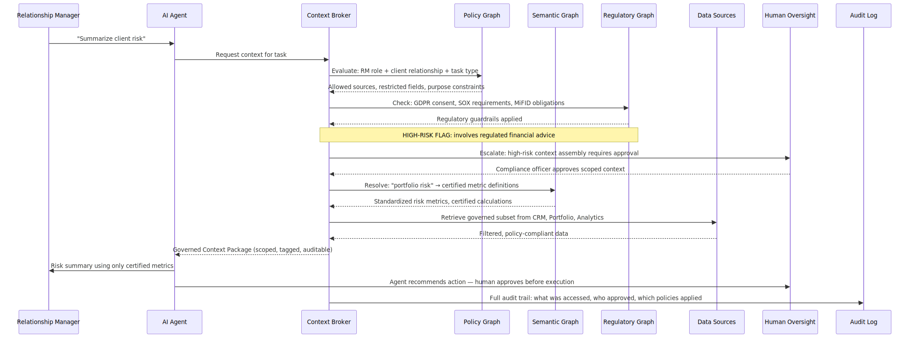

# From Data Catalogs to Context Control Planes: Governing the Agentic Enterprise

### A White Paper on Enterprise Architecture for the Age of AI Agents

**Author:** Keshav Singh | **Published:** June 2026

**The next decade of enterprise architecture will not be defined by larger models. It will be defined by better context.**

---

## Executive Summary

The rise of AI agents fundamentally breaks the governance model that enterprises have relied on for two decades. Traditional governance asks: *"Can this user access this data?"* Agentic systems demand a different question: *"What context should an autonomous system be allowed to understand, reason over, and act upon?"*

This paper introduces the **Context Control Plane** — a new architectural layer that governs not data access, but machine understanding. It presents:

- **The Six Graphs** of the agentic enterprise (Data, Metadata, Policy, Lineage, Semantic, Regulatory) and their build-order dependencies
- **A Reference Architecture** with the Context Broker as the runtime governance engine, including federated multi-cloud deployment patterns
- **The Protocol Governance Layer** showing how MCP, A2A, and tool-use protocols integrate with the Context Control Plane through concrete gateway patterns
- **The Semantic Medallion** extended to a Platinum layer — governed, ephemeral, auditable context assembly — with architectural justification for why context is not simply "Gold + governance at query time"
- **The Contextual Inference Problem** — why AI systems can infer protected information even when direct access is denied — and four concrete mitigation mechanisms grounded in prior art from differential privacy and information-theoretic privacy
- **A Regulatory Mapping** showing how GDPR, the EU AI Act, CCPA, DMA, HIPAA, and SOX all implicitly demand context governance
- **An Operating Model** with four new roles, a CDAIO accountability structure, and data mesh integration patterns
- **Anti-Patterns, Observability KPIs, and a Phased Implementation Roadmap** — the operational realism required to move from whiteboard to production

The central thesis: **emerging AI regulations are implicitly demanding the existence of a Context Control Plane, even if regulators are not using that language.** The organizations that build this layer will govern the future of enterprise intelligence. Those that do not will discover that the greatest risk of AI is not hallucination — it is ungoverned understanding.

---

## The Inflection Point

For nearly two decades, enterprise data governance has revolved around a deceptively simple question:

> _Can a user access a piece of data?_

Data catalogs, access control lists, lineage systems, compliance frameworks — all were designed for a **human operating model**. A human analyst requests information. A governance system decides if that access is appropriate. The loop closes.

Then Generative AI happened. Then agents happened.

And that loop shattered.

In an agentic enterprise, machines do not merely retrieve data. They **interpret** it. They **connect** information across system boundaries. They **reason** over business concepts. They **generate** conclusions. They **execute** actions — sometimes autonomously.

The question is no longer:

> _Does the user have access to this data?_

The question is:

> **What context should an autonomous system be allowed to understand, reason over, and act upon?**

This distinction appears subtle. **It is not.** It represents the largest architectural shift in enterprise governance since the emergence of the modern data warehouse.

---

## Making It Real: An Agent Without Governance

Consider this concrete scenario. A financial services company deploys an AI agent to assist relationship managers:

> **User prompt:** _"Summarize this client's portfolio risk and recommend next steps before tomorrow's meeting."_

Without a Context Control Plane, the agent:

1. Queries the CRM for client details — pulls full contact record including personal notes
2. Hits the portfolio management system — retrieves all positions including restricted securities
3. Accesses the analytics platform — pulls risk metrics, some derived from unvalidated models
4. Searches internal communications — finds email threads marked as privileged legal correspondence
5. Cross-references with market data — correlates with insider-knowledge-adjacent research
6. **Generates a recommendation** — blending compliant and non-compliant context indistinguishably

No single data access was obviously wrong. But the **assembled context** violated three regulations, breached two internal policies, and created an audit trail that no compliance officer could reconstruct.

This is not a hypothetical. This is what happens when agents operate at enterprise scale without context governance.

**The problem is not that the agent accessed bad data. The problem is that nobody governed the context assembly.**

*Later in this paper, we return to this exact scenario and show how a Context Control Plane transforms the same request into a governed, auditable, and compliant interaction — with human oversight at architecturally enforced intervention points.*

---

## The Hard Truth: Why Most Enterprises Are Not Ready

Before we architect the future, we must confront the present.

Most enterprises cannot build a Context Control Plane today — not because the architecture is wrong, but because the **prerequisites are unmet**. The average enterprise data estate looks like this:

- **40-70% of data assets** have no documented owner or steward
- **Business glossaries** exist in spreadsheets maintained by one person who left two years ago
- **Data quality** is measured reactively — after a dashboard breaks — not proactively at ingestion
- **Lineage** stops at the ETL layer; nobody tracks how a Tableau calculated field or a Looker measure was derived
- **Metadata** lives in five different systems that do not talk to each other
- **Policy enforcement** is manual — access reviews happen quarterly, if at all

This is not a criticism. It is a structural consequence of two decades of building data systems optimized for human consumption, not machine reasoning.

It means the path to a Context Control Plane is not a single leap. It is a **sequenced transformation** — and the sequence matters enormously.

### The Minimum Viable Context Control Plane

The minimum viable CCP is not all six graphs fully materialized. It is:

> **A Metadata Graph + a Policy Graph + a Context Broker** that can assemble governed context for **a single high-value agent use case**.

Start narrow. Prove the architecture. Then expand.


**Phase 1 is unsexy but non-negotiable.** Without ownership, you cannot assign stewardship to graph nodes. Without a glossary, the Semantic Graph has no vocabulary. Without quality baselines, every context the broker assembles is suspect.

The organizations that try to skip to Phase 4 without Phase 1 will build sophisticated machinery on top of unreliable foundations — and they will learn this the hard way, usually during a regulatory audit or an agent-generated decision that cannot be explained.

---

## The Governance Problem Nobody Is Talking About

Most enterprise AI conversations remain fixated on models. _Which model? How large? What retrieval architecture? How do we reduce hallucinations?_

These are valid engineering questions. But they are **not the fundamental challenge**.

The fundamental challenge is **governance**.

An AI system is only as trustworthy as the context it receives:

- **Incomplete context** → incorrect reasoning
- **Inconsistent context** → conflicting answers
- **Policy-violating context** → compliance risk
- **Context without business meaning** → the agent invents its own

Historically, governance occurred **before** reasoning — a gatekeeper at the data layer.

In agentic systems, governance must occur **during** reasoning — a runtime participant in cognition itself.

This requires an entirely different architecture.


The architectural difference is stark when reduced to its essence:

```
Traditional:    User  →  Asset  →  Access Decision
Agentic:        User  →  Agent  →  Context  →  Reasoning  →  Action
```

Governance is no longer about controlling access to assets. **Governance is controlling the context through which machines understand reality.** This shift transforms governance from a static control process into a **dynamic runtime system**.

The remainder of this paper presents the architectural answer: a layered system of graphs, brokers, protocols, and organizational structures that collectively form **the Context Control Plane** — followed by the operational realism required to build it: phasing, anti-patterns, observability, and investment justification.

---

## The Enterprise Context Layer: A New Architectural Primitive

Recent industry developments point toward the emergence of a new architectural component. Google's **Knowledge Catalog** — launched as an evolution of Dataplex — is perhaps the most visible signal. It moves beyond traditional metadata cataloging into a knowledge-graph-backed, AI-native governance surface. It understands not just _where_ data lives, but _what it means_, _how it relates_, and _who should access it_ — in the context of machine consumption, not just human discovery.

But Google is not alone. The convergence of Collibra's governance platform, Atlan's active metadata architecture, Microsoft Purview's AI-aware classification, and the maturation of semantic layers (dbt, Cube, MetricFlow) all point in the same direction:

### The Enterprise Context Layer

This layer sits between enterprise systems and AI agents. Its purpose is not simply to locate information. Its purpose is to provide **trusted understanding**.



Together, these elements form an **Enterprise Context Graph** — not a catalog, not a warehouse, not a vector database — but a governed representation of enterprise knowledge.

The Enterprise Context Layer is the *what* — the conceptual capability. The next section defines the *how* — the structural decomposition of that capability into six distinct, interconnected graphs.

---

## The Six Graphs of the Agentic Enterprise

Most organizations think of a knowledge graph as a single monolithic construct. In practice, agentic governance requires **six interconnected graphs**, each answering a fundamentally different question.



| Graph                | Core Question                     | What It Models                                                        | Relationship to Next Graph | Why This Dependency Exists                                                                                          |
| -------------------- | --------------------------------- | --------------------------------------------------------------------- | -------------------------- | ------------------------------------------------------------------------------------------------------------------- |
| **Data Graph**       | _What exists?_                    | Business entities — customers, products, transactions, events         | _described by_ → Metadata  | You cannot attach metadata to assets you haven't identified. The Data Graph provides the anchors Metadata describes. |
| **Metadata Graph**   | _What do we know about our data?_ | Datasets, columns, owners, refresh schedules, quality scores          | _constrained by_ → Policy  | Policies reference metadata attributes (owner, classification, sensitivity) to determine what rules apply.           |
| **Policy Graph**     | _What is allowed?_                | Privacy classifications, access rules, retention, purpose limitations | _audited via_ → Lineage    | Enforcement is meaningless without proof. Lineage provides the provenance trail that validates policy compliance.     |
| **Lineage Graph**    | _Where did this come from?_       | Sources, transformations, pipelines, derived metrics                  | _interpreted through_ → Semantic | Raw lineage chains are technical plumbing. The Semantic Graph gives them business meaning agents can reason over. |
| **Semantic Graph**   | _What does this mean?_            | Business concepts, glossary terms, ontologies, metric definitions     | _governed by_ → Regulatory | Regulations reference business concepts (personal data, financial metric), not technical column names.               |
| **Regulatory Graph** | _Which regulations apply?_        | GDPR, EU AI Act, CCPA, DMA, HIPAA, SOX obligations mapped to data    | _applies to_ → Data        | Regulations ultimately constrain what can be done with data assets, completing the governance cycle.                  |

Together, these six graphs create something far more powerful than a catalog. They create a **machine-understandable model of the enterprise**.

### Graph Sequencing: Build Order Matters

No organization builds all six graphs simultaneously. The dependency chain dictates the sequence:



**Start with the Metadata Graph.** You cannot govern what you cannot describe. Then codify policies against those described assets. Add lineage to verify trust. Only then do entity resolution and semantic enrichment become meaningful — and only after all of these foundations exist can the Regulatory Graph reliably map obligations to the right data, through the right policies, with auditable provenance.

Attempting the Semantic or Regulatory Graph before the Metadata and Policy Graphs are solid produces a beautiful ontology connected to unreliable metadata — which is worse than no ontology at all, because it creates false confidence.

---

## The Context Control Plane: A New Architectural Layer

For decades, enterprise architecture has evolved through a series of control planes:

- The **network era** introduced network control planes
- The **cloud era** introduced infrastructure control planes (Kubernetes)
- The **data era** introduced data platforms and governance layers
- The **AI era** introduces: **The Context Control Plane**

> A **Context Control Plane** is a governance runtime that determines what an AI system knows, what it is allowed to understand, what it can reason about, and what actions it can perform.

Just as Kubernetes became the control plane for cloud-native infrastructure, the **Context Control Plane will become the control plane for enterprise intelligence**.

### Reference Architecture


### Centralized vs. Federated: The Multi-Cloud Reality

Real enterprises do not live in a single cloud. They span AWS, Azure, GCP, on-premises data centers, and dozens of SaaS platforms. This raises a fundamental architectural question:

**Is the Context Control Plane centralized or federated?**

The answer is **federated with centralized policy**.



**Policy, semantics, and regulatory rules are global** — they do not change because data lives in AWS vs. Azure. These are centrally managed and synchronized to regional brokers.

**Metadata, lineage, and data graphs are local** — they describe assets within their cloud or platform boundary. Each region runs its own Context Broker that can evaluate context requests against local metadata while enforcing globally consistent policy.

**Cross-cloud context assembly** requires federated query across brokers. When an agent needs context that spans Snowflake (AWS) and BigQuery (GCP), the brokers coordinate — each applying local data governance while enforcing shared policy. This mirrors how federated identity works today (central IdP, regional enforcement) and avoids the trap of centralizing all metadata into a single platform that creates vendor lock-in and latency bottlenecks.

### The Context Broker: The Key Innovation

The most critical component is not the graph layer — it is what sits **in front of it**: the **Context Broker**.

A Context Broker acts as a **governance runtime** for AI systems. Rather than allowing agents to query enterprise systems directly, the broker assembles a **temporary, task-specific, policy-aware view** of the enterprise.

For every request, the broker evaluates:


The output is not raw data. The output is **governed context** — the foundation for trustworthy reasoning.

---

## The Protocol Convergence: MCP, A2A, and the Context Highway

No architectural vision exists in isolation. The Context Control Plane converges with a parallel revolution in **agent communication protocols** that is reshaping how AI systems interact with tools, data, and each other.

### The Emerging Protocol Stack



**Model Context Protocol (MCP)** standardizes how agents connect to data sources and tools — but it says nothing about _governance_. An MCP server exposes enterprise data to any agent with a connection. Without a Context Broker mediating that connection, MCP becomes an ungoverned data fire hose.

**Agent-to-Agent Protocol (A2A)** enables multi-agent collaboration — agents delegating tasks, sharing intermediate results, coordinating actions. But when Agent A shares context with Agent B, who governs what context crosses that boundary? Without a Context Control Plane, inter-agent communication becomes an unauditable trust chain.

**Tool Use / Function Calling** lets agents execute real-world actions — database writes, API calls, approvals. But the permission to call a function is not the same as the permission to act on the context that informed the call.

The insight is this: **MCP, A2A, and tool-use protocols define the plumbing. The Context Control Plane defines the governance.** They are complementary, not competitive. Every organization deploying agents at scale will need both — protocols for connectivity and a control plane for trust.

### The Integration Surface: How Protocols Meet the Broker

Concretely, the Context Broker interposes at three integration points:



**MCP Gateway:** Every MCP `resource` and `tool` call passes through a broker gateway that evaluates the request against the Policy and Regulatory Graphs before forwarding to the MCP server. The response is filtered and tagged with provenance metadata before reaching the agent. The MCP server itself remains unchanged — the governance layer wraps it.

**A2A Gateway:** When agents delegate tasks via A2A, the broker enforces **context boundaries** — ensuring Agent B receives only the context subset that Agent A's delegating user is authorized to share. This prevents privilege escalation through agent chains, where a low-privilege user's agent delegates to a high-capability agent that accesses data the original user should never see.

**Action Gateway:** Before any tool execution, the broker evaluates whether the **assembled context that informed the decision** justifies the proposed action. The permission to call `send_email()` is table stakes. The real question is: _"Given the context this agent has assembled, should this email be sent?"_

---

## The Unstructured Context Problem: Documents, RAG, and Vector Stores

There is an elephant in the architecture. Everything described so far primarily addresses structured data — tables, columns, metrics, entities. But ask any engineer who has built a production agent system: **where does most of the context actually come from?**

Contracts. Legal opinions. Meeting transcripts. Emails. Slack threads. Confluence pages. PDFs. SharePoint documents. Board decks. Customer support tickets.

For many agent use cases, **unstructured context is the primary context.** A Context Control Plane that governs only structured data governs only half the enterprise.

### How Agents Consume Unstructured Data Today

The dominant retrieval pattern in production agent systems is **Retrieval-Augmented Generation (RAG)**: documents are chunked, embedded into vector representations, stored in a vector database, and retrieved via semantic similarity search at inference time.

This creates a governance gap that the structured-data world does not face:


The problems are severe:

- **Lineage is destroyed at embedding time.** Once a paragraph is chunked and vectorized, its provenance (which document, which version, which author, which classification) is often lost or stored as unstructured metadata that no policy engine can evaluate.
- **Access control does not transfer to chunks.** A document classified as "Legal — Privileged" may be chunked and embedded alongside public marketing materials. Semantic similarity search returns the most relevant chunks regardless of classification.
- **Semantic similarity is not policy-aware.** A query about "client risk exposure" may retrieve chunks from a privileged legal memo because the text is semantically similar — even though the user's agent has no authorization to access that document.
- **Audit trails are incomplete.** Which chunks were retrieved? From which documents? Under which version? With which classification? Most RAG pipelines do not capture this with sufficient granularity for regulatory reconstruction.

### Governed RAG: The Context Broker as a Retrieval Mediator

The Context Control Plane addresses this by making the **Context Broker the mediator of all retrieval** — structured and unstructured:



The critical innovations are:

**Provenance-Tagged Embeddings.** At ingestion time, every chunk is tagged with its source document ID, version, owner, data classification, applicable policies, and regulatory obligations. These tags travel with the embedding as structured metadata in the vector store — transforming the vector database from an unstructured retrieval engine into a **policy-evaluable context source**.

**Partitioned Vector Spaces.** Rather than searching the entire vector store, the Context Broker first evaluates policy to determine which document partitions (by classification, department, regulation) the requesting agent is authorized to access. The similarity search is scoped to those partitions only. A legal-privileged document partition is simply invisible to an agent whose user lacks legal privilege — no amount of semantic similarity will surface it.

**Chunk-Level Lineage.** Every chunk returned to the agent includes its provenance chain: *source document → version → chunk position → embedding model → retrieval timestamp → policy evaluation result*. This enables full audit reconstruction: *"This paragraph from contract v3.2 was retrieved because the agent queried 'liability exposure,' and Policy Rule 7.4.1 authorized access because the user holds the Legal Advisor role."*

**Semantic Grounding for Unstructured Context.** The Semantic Graph maps business concepts to both structured metrics and unstructured document collections. When an agent asks about "revenue recognition policy," the broker retrieves not just the certified metric definition from the Gold layer but also the governing policy document chunks — both governed by the same Context Broker evaluation pipeline.

This is how the Context Control Plane handles the reality that enterprise knowledge lives in documents as much as it lives in databases.

---

## The Semantic Medallion: Evolving Data into Intelligence

The traditional medallion architecture introduced Bronze, Silver, and Gold layers to improve data quality. The next evolution extends these principles into **semantics and intelligence**.


The critical transformation occurs at the **Silver layer**. Before machines can reason safely, organizations must establish **stable identity across systems**. Without identity, there is no knowledge graph. Without knowledge graphs, there is no trusted context. Without trusted context, there is no governed AI.

### Why Platinum Is Not Just "Gold + Governance"

A fair challenge: _"Why can't context simply be the Gold layer with governance policies applied at query time? Why does it need its own materialized layer?"_

Three reasons:

**1. Context is combinatorial, not tabular.** Gold produces certified metrics and KPIs — single facts. Platinum produces _assembled context packages_ that combine facts from multiple Gold-layer sources with policy constraints, semantic relationships, lineage provenance, and regulatory tags into a coherent, scoped view. This assembly is itself a computation — with caching, versioning, and invalidation semantics that do not exist at the Gold layer.

**2. Context is ephemeral and task-specific.** Gold-layer assets are persistent — a certified revenue metric exists regardless of who queries it. Platinum-layer context is **temporary and purpose-bound** — it is assembled for a specific agent, performing a specific task, under specific policies, and it expires when the task completes. This lifecycle is fundamentally different from the Gold layer's "publish once, consume many" model.

**3. Context requires its own audit surface.** Regulators will not ask _"What metrics exist?"_ (Gold). They will ask _"What context was assembled for this agent, for this decision, at this moment?"_ (Platinum). This requires a dedicated audit trail that tracks context assembly events — which sources contributed, which policies were evaluated, which fields were filtered — information that has no natural home in the Gold layer.

The Platinum layer is not data. It is **a governed, ephemeral, auditable assembly of knowledge** — and that distinction is what makes it architecturally distinct.

> **Raw Records → Entities → Relationships → Knowledge → Context → Intelligence → Action**

This is the transformation pipeline of the agentic enterprise.

---

## The Maturity Model: From Catalog to Context Control Plane

Where does your organization stand? This maturity model maps the journey from basic cataloging to full autonomous governance.


| Level | Stage         | Core Question                | Key Capabilities                                         | Tooling Era                               |
| ----- | ------------- | ---------------------------- | -------------------------------------------------------- | ----------------------------------------- |
| **1** | Cataloged     | _What data do we have?_      | Metadata management, asset inventory                     | Atlas, Glue Catalog                       |
| **2** | Governed      | _Who can access data?_       | Classification, access controls, stewardship             | Collibra, Alation, Purview, Dataplex      |
| **3** | Semantic      | _What does data mean?_       | Business glossary, metrics layer, ontologies             | dbt Semantic Layer, LookML, Cube          |
| **4** | Knowledge     | _How are things connected?_  | Knowledge graphs, entity resolution, semantic lineage    | Graph DBs, RDF/OWL, Semantic Medallion    |
| **5** | Context-Aware | _What should an agent know?_ | Runtime policy evaluation, dynamic context assembly      | Google Knowledge Catalog, Context Brokers |
| **6** | Autonomous    | _What should an agent DO?_   | Action governance, delegated authority, continuous audit | Agent governance platforms (emerging)     |

Most enterprises today operate between **Levels 1-3**. The agentic revolution demands a rapid ascent to **Level 5+**.

---

## The Market Evolution: Five Generations of Governance

The market is already converging on Context Control Planes — even if vendors use different language.


The trajectory is clear:

> **Data → Metadata → Semantics → Knowledge → Context**

Each generation subsumes the previous. Context Control Planes do not replace catalogs — they **elevate** them into a runtime governance layer for machine intelligence.

---

## The Regulatory Imperative: Why Context Governance Is Not Optional

Here is the argument that transforms this from a technology vision into an enterprise mandate:

> **Emerging AI regulations are implicitly demanding the existence of a Context Control Plane — even if regulators are not using that language.**

### The Regulatory Convergence

GDPR, the EU AI Act, CCPA, DMA, HIPAA, SOX — examined individually, they appear to address different domains. Examined architecturally, they all converge on the **same requirement**:

> Organizations must be able to **explain, constrain, audit, and govern** how AI systems acquire and use information.

That is fundamentally a **context governance problem**.



### GDPR Was the First Context Governance Law

Viewed through the lens of agentic systems, GDPR is not merely a privacy regulation. It is a **context governance framework** that requires organizations to know what personal data exists, where it came from, why it is being used, who can access it, how long it is retained, and whether consent exists.

In graph terms, GDPR effectively mandates portions of the **Data Graph**, **Policy Graph**, and **Lineage Graph** — whether organizations realize it or not.

### The EU AI Act Is a Context Governance Law

The EU AI Act requires organizations to manage risk, transparency, human oversight, traceability, monitoring, and documentation for AI systems. Agentic systems that dynamically retrieve information from dozens of systems during execution cannot be governed by traditional static controls.

A Context Control Plane provides the answer — every context retrieval becomes:

```
Context Request → Policy Evaluation → Authorized Context → Reasoning → Audit Record
```

This directly supports AI Act requirements around traceability and accountability.

### The New Privacy Frontier: Contextual Inference

Perhaps the most provocative governance challenge: **AI systems can infer sensitive information even when direct access is denied.**


This pattern repeats across domains:

- **No access to health records** — but access to leave history, insurance claims, calendar patterns → agent infers medical conditions
- **No access to M&A plans** — but access to executive calendars, legal retainer patterns, unusual data room activity → agent infers acquisition targets
- **No access to termination decisions** — but access to performance reviews, PIP documents, recruiter activity for the role → agent infers workforce changes

The future privacy challenge is not only data exposure. It is **contextual inference exposure**. This is an entirely new governance frontier — and one that only a Context Control Plane can address, because it governs not just what data is accessed, but **what combinations of context are assembled**.

> **The shift: from "Protect the Data" to "Protect the Context."**

Traditional column-level masking and row-level security cannot prevent inference. Only a system that understands the _semantic relationships between data elements_ — the Semantic Graph and Policy Graph working in concert — can detect and prevent dangerous context combinations before they reach the agent's reasoning engine.

### Mitigation Mechanisms: How a Context Broker Prevents Inference Attacks

Identifying the problem is insufficient. Here are four concrete mechanisms a Context Control Plane deploys:


**Context Budgets** cap the number of correlated attributes per entity per task. An agent building a client summary can access job title _or_ location _or_ seniority — but not all three simultaneously when salary is a protected attribute. Critically, context budgets are **purpose-aware**: the broker evaluates the agent's stated task purpose against the budget threshold. A "generate team roster" task may legitimately require all three attributes without inference risk (the purpose is organizational, not compensatory), while a "benchmark this employee" task with the same attributes triggers the budget limit. When a legitimate task exceeds the budget, the broker routes the request to a human approver for a **purpose-justified budget override** — logged, auditable, and time-bounded.

**Combinatorial Policy Rules** explicitly define forbidden attribute combinations in the Policy Graph. If `{title, location, seniority, team_size}` together enable salary inference, the policy engine denies the combination even though each individual attribute is permitted.

**Semantic Proximity Detection** uses the Semantic Graph to calculate the "inference distance" between requested attributes and protected attributes. When the requested context moves within a configurable threshold of a protected concept, the broker flags or blocks the request. This mechanism draws on established prior art in privacy-preserving data analysis — specifically the concepts of **k-anonymity** (ensuring an individual cannot be distinguished from k-1 others), **l-diversity** (ensuring sensitive attributes have diverse values within equivalence classes), and **information-theoretic privacy** measures that quantify how much additional information an attribute combination reveals about a protected attribute. The innovation is applying these principles not at the database query layer, but at the **context assembly layer** — where the unit of protection is not a row in a table but a combination of attributes across multiple sources assembled into an agent's reasoning context.

**Differential Context** generalizes attributes when full precision would enable inference. Instead of returning "Senior Staff Engineer, San Francisco, Team of 12," the broker returns "Engineering, West Coast, Mid-to-large team" — reducing inference precision below actionable thresholds while preserving reasoning utility.

---

## The Future of Compliance: From Retrospective Audit to Runtime Enforcement


Compliance moves from **retrospective review** to **runtime enforcement**. Instead of encoding regulations into application code, regulations become **machine-readable governance context** within the Regulatory Graph — dynamically applied at the Context Broker layer.

---

## The Strategic Transformation Map

Before moving to the operational sections — the governed scenario, operating model, anti-patterns, and investment case — it is worth pausing to synthesize. The preceding sections have described architecture, protocols, regulatory drivers, and compliance evolution. The following map distills these into the seven fundamental shifts that define the transformation from legacy governance to agentic governance:


---

## The Same Scenario, Governed: An Agent With a Context Control Plane

At the beginning of this paper, we watched an AI agent destroy compliance, breach privilege, and create an unauditable decision — all while performing a routine task. Every individual data access was arguably legitimate. The assembled context was not.

Now return to that same scenario. The same agent. The same prompt. The same enterprise systems. But this time, a Context Control Plane mediates every interaction:

> **User prompt:** _"Summarize this client's portfolio risk and recommend next steps before tomorrow's meeting."_

With a Context Control Plane, the flow transforms:



Every context retrieval is **scoped, policy-evaluated, semantically resolved, and audit-logged**. The privileged legal correspondence is never assembled into context. The unvalidated risk models are excluded in favor of certified metrics. The agent operates within a governed perimeter — and the entire reasoning chain is reconstructable.

### Human-in-the-Loop Is Not Optional

The EU AI Act mandates human oversight for high-risk AI systems. The sequence diagram above shows two critical human intervention points that must be architecturally supported:

**1. Context Assembly Approval.** For high-risk domains (financial advice, medical decisions, legal analysis), the Context Broker escalates to a human approver _before_ assembling the full context package. The human reviews what sources will be included, which policies are being applied, and whether the scope is appropriate. This is not a blanket approval — it is a **context-aware authorization decision**.

**2. Action Approval.** Even after governed context produces a recommendation, high-risk actions (submitting a trade, sending a regulatory filing, modifying a patient record) require human confirmation _before_ execution. The agent proposes; the human disposes.

The architectural requirement is clear: the Context Broker must support **configurable escalation thresholds** — defined in the Policy Graph and Regulatory Graph — that route specific context assemblies or action requests to human reviewers. These thresholds are not hardcoded. They are graph-driven, policy-evaluated, and auditable.

This is the difference between AI that works and **AI that can be trusted**.

---

## The Operating Model: Who Owns the Context Control Plane?

The preceding sections have described *what* to build and *how* it works. But technology is the easier half of this transformation. The harder half — the half that determines whether the CCP actually gets built or becomes another architectural diagram on a shared drive — is **organizational**.

Architecture without organizational accountability is a whiteboard exercise. The Context Control Plane demands a clear operating model — and it exposes a gap that most enterprises have not addressed.

### The Accountability Gap

Today's governance accountability looks like this:

| Function                   | Typical Owner         |
| -------------------------- | --------------------- |
| Data access & security     | CISO / Security       |
| Data quality & stewardship | CDO / Data Governance |
| AI model risk              | AI/ML Platform team   |
| Regulatory compliance      | Legal / Compliance    |
| Application architecture   | CIO / Engineering     |

The Context Control Plane cuts across **every one of these functions**. No single existing role owns it. And when nobody owns it, nobody builds it.

### New Roles for the Agentic Enterprise


**Context Engineers** are not data engineers. They build graph infrastructure, broker services, and protocol gateways. They think in relationships and policies, not tables and pipelines.

**Context Stewards** are the domain-expert successors to today's data stewards. They do not just tag datasets — they curate semantic definitions, validate entity resolution across systems, and certify which metrics agents are allowed to use.

**Context Policy Analysts** sit at the intersection of legal, compliance, and engineering. They translate regulatory prose into machine-readable rules in the Policy and Regulatory Graphs. When the EU AI Act says _"high-risk AI systems shall be designed to enable traceability,"_ the Context Policy Analyst turns that into graph constraints the Context Broker enforces at runtime.

**Context Ops / SRE** operates the CCP as a production system. Because the Context Broker sits in the critical path of every agent interaction, it must be treated with the same rigor as a payment processing system — uptime SLAs, latency budgets, circuit breakers, and incident response.

---

## Data Mesh Meets Context Control Plane: Federated Ownership, Unified Governance

Many enterprises are adopting **data mesh** — domain ownership, data-as-a-product, self-serve infrastructure, and federated computational governance. The Context Control Plane does not replace data mesh. It **extends** it into the agentic era.

The central tension:

> In a data mesh, domains own their data products. In a Context Control Plane, context is assembled _across_ domain boundaries. **Who governs context when multiple domains contribute?**



The resolution follows data mesh's own principle of **federated computational governance**:

- **Domains own their data products** and their local Metadata and Lineage Graphs. Each domain decides what to publish and maintains quality.
- **Domains declare context contracts** — machine-readable interfaces that specify what context their data products provide, under what policies, with what semantic definitions. This is the data product contract extended for agent consumption.
- **The Context Broker enforces cross-domain policy** at assembly time. When an agent needs context from Sales + Finance + Risk, the broker evaluates each domain's context contract, applies the union of applicable policies, and assembles only the intersection of what all three domains authorize.
- **The Semantic and Policy Graphs are federated** — each domain contributes its local ontology and rules, and the central plane resolves conflicts and enforces consistency.

### Anatomy of a Context Contract

What does a context contract actually look like? Here is an example from a Sales domain publishing its Customer 360 data product:

```yaml
# Context Contract: Customer 360 (Sales Domain)
context_contract:
  domain: sales
  data_product: customer-360
  version: 2.4.1

  exposed_entities:
    - entity: Customer
      attributes:
        - name: customer_id       # always available
        - name: company_name      # always available
        - name: industry_segment  # always available
        - name: account_tier      # requires: role >= account_manager
        - name: lifetime_value    # requires: role >= sales_director
        - name: churn_risk_score  # requires: certified_metric_consumer

  semantic_bindings:
    - term: "customer"
      maps_to: "glossary:enterprise.customer.v3"
    - term: "churn risk"
      maps_to: "metric:certified.churn_risk_score.v2"
    - term: "lifetime value"
      maps_to: "metric:certified.ltv.v4"

  policy_constraints:
    gdpr_scope: true
    pii_fields: [customer_id, company_name]
    retention: 7_years
    purpose_limitation: [sales_operations, risk_assessment]
    forbidden_combinations:
      - [account_tier, industry_segment, lifetime_value]

  lineage:
    sources: [crm.salesforce, erp.sap, analytics.snowflake]
    refresh: daily_0400_utc
    quality_score: 0.94
```

This contract is machine-readable. The Context Broker consumes it at assembly time, evaluates it against the requesting agent's role and task purpose, and determines which attributes to include in the governed context package. The `forbidden_combinations` field directly feeds the inference mitigation mechanisms described earlier. The `semantic_bindings` ensure the agent reasons over certified definitions rather than inventing its own. The `purpose_limitation` constrains which agent task types can access this data product at all.

Every domain publishes a contract. The Context Broker reads them all. Cross-domain context assembly becomes a matter of contract intersection, not ad-hoc integration.

Data mesh without a Context Control Plane produces governed data products that agents consume ungoverned. A Context Control Plane without data mesh creates a centralized bottleneck that domains resist. **The two architectures need each other.**

---

## Anti-Patterns: How Context Control Planes Fail

Every architectural vision must answer: _"What does failure look like?"_ Here are the five most dangerous anti-patterns.

### 1. The Context Bottleneck

**Symptom:** The Context Broker becomes a single point of failure. Every agent request queues behind a centralized service. Latency spikes. Teams bypass the broker with direct database connections "just for this one use case."

**Cause:** Treating the CCP as a centralized gateway instead of a distributed, cacheable, horizontally scalable service.

**Fix:** Design the broker as a **sidecar or mesh pattern** — not a monolithic proxy. Context policies are evaluated locally where possible, with centralized policy sync. Pre-computed context packages are cached for common agent tasks.

### 2. The Policy Hallucination

**Symptom:** The Policy Graph contains rules that are syntactically correct but semantically wrong — denying legitimate access or allowing prohibited access. Agents produce inconsistent behavior across seemingly identical requests.

**Cause:** Policy rules authored by engineers who translated legal requirements without domain expert validation. No feedback loop between policy enforcement outcomes and policy authors.

**Fix:** Every policy rule must have a **steward, a test suite, and a review cadence**. Policy-as-code requires the same rigor as application code — version control, peer review, automated testing, and production monitoring.

### 3. The Semantic Swamp

**Symptom:** The Semantic Graph contains thousands of glossary terms, but agents still produce conflicting answers about basic business concepts. "Revenue" means three different things depending on which graph path the broker traverses.

**Cause:** Semantic Graph built bottom-up from existing documentation without cross-domain reconciliation. Multiple teams contributed definitions without a conflict resolution process.

**Fix:** Semantic Graphs require **authoritative definitions with explicit precedence**. When conflicts exist, the graph must encode which definition is canonical for which context. Ambiguity is not a feature — it is a governance failure.

### 4. The Governance Theater

**Symptom:** The CCP exists on paper. Context Broker logs show policy evaluations happening. But the policies are so permissive that they never deny anything. The system produces audit trails that look compliant but provide no actual governance.

**Cause:** Organizational pressure to "not slow down AI adoption." Policies set to warn-only and never promoted to enforce. No executive accountability for governance outcomes.

**Fix:** Governance effectiveness must be **measured, not assumed**. If the policy violation rate is zero, either the organization has perfect data practices (unlikely) or the policies are meaningless. Track denial rates, escalation rates, and inference-risk scores as first-class KPIs.

### 5. The Graph Graveyard

**Symptom:** The six graphs were built with significant investment but are not maintained. Metadata Graph reflects the schema from eighteen months ago. Policy Graph does not include the new regulations. Lineage Graph stopped updating when the team that built it was reorged.

**Cause:** Treated as a project, not a product. No operating team, no maintenance budget, no SLAs.

**Fix:** The CCP is **a product, not a project**. It has a product owner, a backlog, a team, and a budget. Graphs that are not continuously maintained are worse than no graphs — they create false confidence in stale governance.

---

## Observability: How You Know the CCP Is Working

A Context Control Plane without observability is infrastructure without monitoring — you will not know it has failed until an agent makes an ungoverned decision that reaches a regulator.

### The CCP Dashboard: Key Metrics


| Category        | Metric                         | Why It Matters                                                          | Alert Threshold                                          |
| --------------- | ------------------------------ | ----------------------------------------------------------------------- | -------------------------------------------------------- |
| **Operational** | Context assembly latency (p95) | Agents wait for context; high latency degrades UX and throughput        | > 500ms for standard, > 2s for cross-domain              |
| **Operational** | Broker availability            | CCP downtime = ungoverned agent operations                              | < 99.9% monthly                                          |
| **Governance**  | Policy denial rate             | Too low = permissive theater; too high = over-restriction               | < 1% or > 30% both warrant investigation                 |
| **Governance**  | Human escalation rate          | Validates HITL architecture is functioning                              | > 50% suggests policy thresholds need tuning             |
| **Risk**        | Inference risk score           | Tracks how close assembled contexts get to protected attributes         | Any request within 2 hops of a protected attribute       |
| **Risk**        | Audit completeness             | % of agent decisions with full context provenance                       | < 100% for high-risk domains is a compliance gap         |
| **Risk**        | Policy staleness               | Days since Policy/Regulatory Graph last updated                         | > 30 days post-regulation change                         |
| **Quality**     | Semantic resolution rate       | % of business terms in agent requests resolved to certified definitions | < 80% means agents are reasoning over ambiguous concepts |

**The most dangerous metric is the one you do not track.** If audit completeness is 85%, that means 15% of agent decisions have context provenance gaps — and any of those could be the one a regulator examines.

---

## The Investment Case: Why a CFO Should Fund This

Every architecture paper lives or dies in the budget conversation. The most elegant reference architecture in the world is worthless if the CDAIO cannot stand in front of a CFO and answer: *"Why should we spend money on this instead of building more agents?"* This section provides that answer.

### The Cost of Not Governing Context

The investment case is not "governance is good." The investment case is: **ungoverned agents at enterprise scale create quantifiable, material risk.**

| Risk Category | What Happens Without a CCP | Quantifiable Impact |
|--------------|---------------------------|-------------------|
| **Regulatory fines** | Agent-generated decisions cannot be traced or explained under EU AI Act, GDPR | EU AI Act fines up to 3% of global revenue; GDPR fines up to 4% |
| **Litigation exposure** | Agent assembles privileged legal correspondence into client-facing output | Waiver of attorney-client privilege; malpractice liability |
| **Insider trading risk** | Agent infers M&A activity from calendar + legal retainer patterns | SEC enforcement; personal criminal liability for officers |
| **Reputational damage** | Agent generates recommendation using biased or unvalidated context | Public trust erosion; customer attrition |
| **Agent deployment freeze** | Legal/compliance blocks all agent deployment pending governance framework | Competitive disadvantage; innovation paralysis |

The last row is often the most expensive. Organizations without context governance do not deploy ungoverned agents — they **deploy no agents at all**, because legal and compliance cannot approve what they cannot audit. The CCP is not a cost of doing AI. It is the **prerequisite for doing AI at scale**.

### The Value of Governed Context

| Value Driver | What the CCP Enables | Business Impact |
|-------------|---------------------|----------------|
| **Speed to deployment** | Agents can be deployed with pre-approved context perimeters | Weeks instead of months per agent use case |
| **Audit readiness** | Every agent decision has full context provenance | Pass regulatory audits without retroactive remediation |
| **Agent quality** | Certified metrics and semantic resolution reduce hallucination | Higher accuracy; lower human review overhead |
| **Cross-domain intelligence** | Governed context assembly across silos enables insights no single system provides | Revenue from cross-sell, risk detection, operational efficiency |
| **Reusable governance** | Policy and semantic graphs are shared infrastructure; each new agent use case is incrementally cheaper | Decreasing marginal cost of governed AI |

### The Phased Investment Model

The CCP does not require a single large upfront commitment. It follows the same phased model presented earlier:

- **Phase 1 (Foundation)** — Largely organizational and process investment: assign ownership, standardize glossaries, baseline quality. Low technology cost, high organizational change cost.
- **Phase 2 (Structure)** — Metadata and Policy Graph tooling. This may leverage existing investments (Dataplex, Purview, Collibra, Alation) rather than building net-new.
- **Phase 3 (Semantics)** — Semantic layer and entity resolution. Organizations already investing in dbt, knowledge graphs, or master data management are partially here.
- **Phase 4 (Context)** — Context Broker MVP for a single high-value use case. The incremental investment is the broker layer and observability — the graphs are already built.

Each phase delivers standalone value before the next phase begins. Phase 1 improves data governance even without agents. Phase 2 improves compliance posture. Phase 3 improves analytics consistency. Phase 4 unlocks governed AI. No phase requires faith in the phases that follow.

---

## Scope and Boundaries: What This Paper Does Not Address

Intellectual honesty requires acknowledging what is outside the scope of this framework:

- **Model governance** — selection, evaluation, bias testing, red-teaming, and safety alignment of foundation models. The CCP governs what context a model receives, not how the model processes it.
- **Prompt injection and adversarial attacks** — defense against malicious inputs that attempt to override agent instructions or extract protected context. This is a complementary security concern that operates at the agent runtime layer, not the context layer.
- **Agent memory and state persistence** — how agents retain context across sessions, conversations, or task boundaries. Memory governance (what an agent is allowed to remember) is an emerging concern adjacent to context governance but architecturally distinct.
- **Multi-tenancy** — how a single CCP instance serves multiple organizational tenants with strict isolation. This is an infrastructure design concern rather than an architectural principle.
- **Model fine-tuning governance** — controlling what data is used to fine-tune or train models. This overlaps with the Data and Lineage Graphs but involves distinct MLOps concerns the CCP does not address.

These are not gaps in the framework. They are **adjacent architectural concerns** that will require their own governance layers — and in several cases, will depend on the Context Control Plane as a foundational input. The CCP is a necessary but not sufficient component of full AI governance — but it is the **foundational** component, because every other governance layer needs to know what context was assembled before it can do its job.

---

## The Call to Action: Five Moves Every CTO Must Make Now

The architecture is clear. The regulatory imperative is clear. The investment case is clear. What remains is execution. Here are the five moves that separate organizations that talk about AI governance from those that build it:

### 1. Audit Your Context Readiness

Map your current position on the maturity model. Most organizations will discover they have catalogs (Level 1-2) but lack the semantic and graph infrastructure (Level 3-4) required to build a Context Control Plane. The gap between where you are and Level 5 is your **AI governance debt**.

### 2. Architect for Context, Not Just Data

Stop designing data pipelines that terminate at dashboards. Start designing **context pipelines** that terminate at agent-ready, policy-compliant knowledge assemblies. Every data product you build should answer: _"Can an agent safely consume this?"_

### 3. Treat Governance as a Product, Not a Process

The Context Control Plane is not a committee. It is not a quarterly review. It is a **runtime system** — an engineered product with APIs, SLAs, versioning, and observability. Fund it like infrastructure, because that is exactly what it is.

### 4. Assign Organizational Ownership Now

Appoint a single accountable leader — ideally the CDAIO — and staff the four new roles: Context Engineers, Context Stewards, Context Policy Analysts, and Context Ops. If the CCP has no owner, it will not be built. If it has multiple owners, it will be built inconsistently.

### 5. Start With One Agent, One Domain, One Context Broker

Do not attempt enterprise-wide CCP deployment. Pick a high-value, high-risk agent use case (financial advisory, clinical decision support, regulatory reporting). Build the minimum viable CCP for that single use case. Prove the architecture produces governed, auditable, trustworthy agent behavior. Then expand.

---

## Closing Thought

The first generation of governance **protected data**.

The second generation **governed metadata**.

The third generation will **govern context**.

As AI systems evolve from information retrieval to autonomous reasoning and action, governance can no longer be an afterthought applied after decisions are made. Governance must become an **active participant in the reasoning process itself**.

The organizations that succeed in the agentic era will not be those with the largest models or the most data. They will be those that build **Context Control Planes** capable of making intelligence _explainable_, _governable_, _auditable_, and _compliant_ **by design**.

A decade from now, we may look back at data catalogs the way we look back at early web directories — necessary, foundational, but ultimately insufficient.

The future is not a catalog of assets. The future is a **living, governed representation of enterprise reality** that can be safely consumed by both humans and machines.

That future has a name.

**The Context Control Plane.**


> _The organizations that master context will ultimately govern the future of intelligent systems._

---

_This framework — the Context Control Plane — sits at the intersection of knowledge graphs, semantic architectures, data products, agent governance, Model Context Protocol, Agent-to-Agent protocols, and global AI regulation. It offers the enterprise a unifying architectural construct for the agentic era — not another discussion about RAG, agents, or catalogs in isolation, but a cohesive thesis on how intelligence must be governed._

_The industry is still settling on terminology. The opportunity is to define the destination before the vocabulary hardens. Context Control Plane is that destination._

_The views expressed in this paper represent an independent architectural perspective, informed by enterprise data, AI, and governance practice. They do not represent the position of any organization or vendor._
